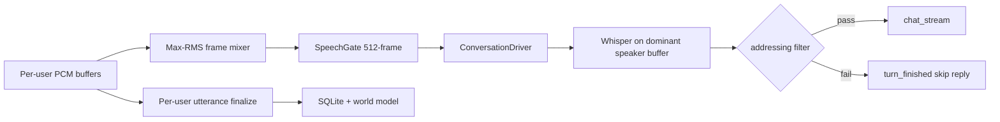

# Phase 02: Core Conversation Mode Integration

> **For agentic workers:** REQUIRED SUB-SKILL: Use superpowers:subagent-driven-development (recommended) or superpowers:executing-plans to implement this plan task-by-task. Steps use checkbox (`- [ ]`) syntax for tracking.

**Goal:** Wire Discord conversational mode to Sapphire core's `ConversationDriver` for turn-taking, barge-in, and streaming LLM+TTS.

**Architecture:** Plugin-local `DiscordConversationRunner` builds `ConversationDriver` + `SpeechGate` + `DiscordConversationSource` directly — **no core file edits**. Uses core classes as libraries only (same pattern as Twilio, but lifecycle stays in `plugins/discord/`).

**Depends on:** [Phase 01](./discord_voice_conversation_phase_01_streaming_tts.md) (`StreamingVoicePlayback` sink contract).

**Tech Stack:** `core.conversation.driver`, `core.conversation.vad`, Phase 01 streaming playback — all imported, never modified.

---

## Problem

Conversational mode today:

```
UtteranceVoiceSink (2.5s silence) → Whisper → provider.chat_completion() → batch TTS → FFmpeg
```

Missing:

- Frame-level VAD and configurable endpoint silence (core settings)
- Barge-in that cancels in-flight LLM stream
- Streaming TTS chunks during LLM generation
- Core turn state machine (`IDLE` / `USER_SPEAKING` / `RESPONDING`)

---

## Multi-user addressing (detailed)

### The tension

| Need | Ideal input |
|------|-------------|
| "Hear everyone for barge-in" | Mixed audio |
| "Know who spoke" | Per-user buffer |
| "Don't reply to side chatter" | Post-STT addressing filter |

### Solution: `ConversationVoiceSink`

One py-cord recording sink, three outputs:



**Frame mixer (for VAD):** Each 20 ms Discord frame, compute RMS per active user; feed the loudest user's mono downsampled slice to the 16 kHz frame accumulator. Ties break to most recently active speaker.

**Turn PCM (for STT):** On VAD endpoint, the driver receives PCM from the **dominant speaker's buffer** accumulated during `USER_SPEAKING` (not the mixed feed). Track `dominant_user_id` during the utterance.

**Addressing filter:** After Whisper, before `chat_stream`:

```python
def discord_transcribe_fn(pcm, *, system, session, settings):
    text = whisper(pcm)
    if not text:
        return None
    log_transcript(session, dominant_user_id, text)  # always log
    if settings.voice.addressing_mode == 'bot_name':
        if not mentions_bot(text, settings):
            return ''  # driver skips reply
    return text
```

**Addressing aliases:** Bot display name + `voice.addressing_aliases` + optional `@mention` stripped forms.

### Addressing modes

| Mode | When to use |
|------|-------------|
| `always` | Bot is an active participant; reply to every turn |
| `bot_name` | Bot is passive in a busy VC; only respond when addressed by name |

Default: `bot_name` (operator preference from planning session).

---

## Chat session binding

```python
CHAT_PREFIX = "discord"

def voice_chat_name(guild_id: str, channel_id: str) -> str:
    return f"{CHAT_PREFIX}:{guild_id}:{channel_id}"
```

On conversational session start:

1. Ensure chat exists in `llm_chat` session manager
2. `mgr.start_external(ctor, chat_name=voice_chat_name(...), source_label="discord", session_id=session.session_id)`
3. Pass `start_word=""` so global wakeword does not apply

On leave / mode change: `mgr.stop_external(session_id)`

---

## Core change (small)

**File:** `core/conversation/manager.py`

Extend `start_external`:

```python
def start_external(self, source_ctor, chat_name=None, source_label="external",
                   session_id=None, *, transcribe_fn=None, start_word=None):
    ...
    driver = self._build_driver(chat_name=chat_name, transcribe_fn=transcribe_fn,
                                start_word=start_word if start_word is not None else ...)
```

Extend `_build_driver` to accept optional `transcribe_fn` and `start_word` override.

**Tests:** `tests/test_conversation_manager.py` — external session with custom transcribe_fn.

---

## File structure

**Create:**

| File | Responsibility |
|------|----------------|
| `voice/discord_conversation_source.py` | Source+sink adapter (Twilio clone) |
| `transport/conversation_voice_sink.py` | Frame feed + per-user utterances |
| `voice/voice_conversation_session_service.py` | `start_external` / `stop_external` lifecycle |
| `voice/voice_addressing.py` | `mentions_bot()`, alias resolution |
| `sapphire/voice_chat.py` | `voice_chat_name()`, ensure chat exists |
| `tests/test_conversation_voice_sink.py` | Mixer, dominant speaker |
| `tests/test_voice_addressing.py` | Name matching |
| `tests/test_discord_conversation_source.py` | Sink contract, frame push |
| `tests/test_voice_conversation_session_service.py` | Lifecycle mocks |

**Modify:**

| File | Change |
|------|--------|
| `voice/voice_listener_service.py` | Conversational mode → `ConversationVoiceSink` + external session |
| `voice/voice_service.py` | Start/stop conversation session on join/leave |
| `runtime/lifecycle.py` | `stop_external` on shutdown |
| `models/settings.py` | `addressing_mode`, `addressing_aliases`, `conversation_core_enabled` |
| `web/index.js` | Addressing mode dropdown |

---

## Tasks

### Task 1: Core `start_external` extensions

- [ ] `transcribe_fn` and `start_word` override on `_build_driver` / `start_external`
- [ ] Tests in `tests/test_conversation_manager.py`

---

### Task 2: Voice chat helper

**Files:** `sapphire/voice_chat.py`

- [ ] `voice_chat_name(guild_id, channel_id) -> str`
- [ ] `ensure_voice_chat(system, guild_id, channel_id) -> str` — create if missing
- [ ] Tests

---

### Task 3: Addressing filter

**Files:** `voice/voice_addressing.py`

- [ ] `mentions_bot(text, bot_names: list[str]) -> bool` — fuzzy contains, case-insensitive
- [ ] `resolve_bot_names(transport, settings) -> list[str]`
- [ ] `build_discord_transcribe_fn(session, settings, ...) -> Callable`
- [ ] Tests: "hey Leona", "LEONA what do you think", no match → False

---

### Task 4: Conversation voice sink

**Files:** `transport/conversation_voice_sink.py`

- [ ] Extends / parallels `UtteranceVoiceSink` structure
- [ ] `on_frame(pcm_stereo, user_id)` internal
- [ ] `push_pcm_hook` callback → `DiscordConversationSource.push_pcm`
- [ ] `on_utterance` callback → existing perception path (unchanged)
- [ ] Dominant speaker tracking during speech
- [ ] `get_dominant_turn_pcm() -> bytes` called at endpoint (engine callback coordination)
- [ ] Tests without Discord: synthetic multi-user frames

---

### Task 5: Discord conversation source

**Files:** `voice/discord_conversation_source.py`

Clone Twilio/browser pattern:

- [ ] `push_pcm(data)` — 48k stereo → 16k mono → 512-sample frames → `gate.is_speech` → `driver.push_frame`
- [ ] Sink delegates to `StreamingVoicePlayback` from Phase 1
- [ ] `close()` stops playback and recording hook
- [ ] Publish `TTS_PLAYING` / `TTS_STOPPED` with `surface: discord`

**Note on turn PCM:** Driver's `_on_turn` receives PCM from engine buffer (mixed VAD path). For dominant-speaker STT, override via custom `transcribe_fn` that reads `sink.get_dominant_turn_pcm()` instead of the passed PCM, OR feed dominant speaker audio into the engine buffer only during USER_SPEAKING (preferred — keeps engine unchanged).

**Preferred approach:** During `USER_SPEAKING`, only push dominant speaker frames into `driver.push_frame`. During `RESPONDING`, push max-RMS mixed frames for barge-in. Implement speaker selection in sink before `push_pcm`.

- [ ] Tests: frame accumulation, sink contract

---

### Task 6: Conversation session service

**Files:** `voice/voice_conversation_session_service.py`

- [ ] `start(session, voice_client, loop) -> bool` — `get_conversation_manager()`, `ensure_voice_chat`, `start_external`
- [ ] `stop(session_id)` — `stop_external`, stop sink
- [ ] Track `session_id -> external_id` mapping
- [ ] Refuse start if slots full (surface error to logs / trace)

---

### Task 7: Listener / service wiring

**Files:** `voice_listener_service.py`, `voice_service.py`, `container.py`

- [ ] If `mode == conversational` and `conversation_core_enabled`: use `ConversationVoiceSink` + session service
- [ ] Else: existing `UtteranceVoiceSink` path unchanged
- [ ] Disable `VoiceConversationService.handle_transcript` conversational branch when core path active
- [ ] Barge-in: remove manual `stop_playback` on utterance when core handles it

---

### Task 8: Settings and UI

- [ ] `addressing_mode`, `addressing_aliases`, `conversation_core_enabled`
- [ ] Web UI: addressing dropdown + alias text field

---

## Exit criteria

- [ ] Conversational mode uses `start_external`; no `provider.chat_completion` in hot path
- [ ] User can interrupt bot mid-sentence (barge-in)
- [ ] First TTS audio plays before LLM finishes (streaming)
- [ ] `bot_name` mode ignores undirected speech but still transcribes
- [ ] `always` mode replies to every turn
- [ ] Transcribe/listen/summarize modes unchanged
- [ ] `stop_external` on disconnect / shutdown

---

## Risks

| Risk | Mitigation |
|------|------------|
| Dominant speaker wrong in crosstalk | Tune RMS thresholds; fall back to `bot_name` filter |
| External slot cap | Log clearly; document `CONVERSATION_EXTERNAL_SLOTS` |
| TTS streaming off | Detect at start; warn operator; fall back to Phase 1 batch |
| Engine buffer ≠ dominant speaker | Only push dominant frames during USER_SPEAKING (see Task 5) |
