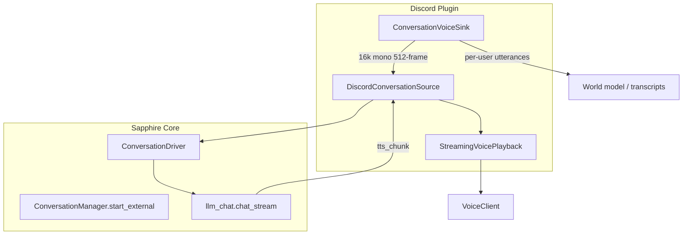

# Discord Voice Conversation — Core Integration Roadmap

> Upgrade Discord conversational voice from utterance-batch STT/LLM/TTS to Sapphire core **conversation mode** (`ConversationManager.start_external`) for streaming TTS and proper turn-taking with barge-in.

**Prerequisite:** Phase 05 voice transport is working (py-cord + DAVE, join/leave, utterance STT, batch TTS). This roadmap layers core conversation mode on top without replacing transport.

**Design decisions (confirmed):**

| Decision | Choice |
|----------|--------|
| Start word | **Off** — no `CONVERSATION_START_WORD` gate for Discord |
| Chat persistence | **Dedicated chat per VC** — `discord:{guild_id}:{channel_id}` |
| Multi-user addressing | **Hybrid** — see [Phase 02 addressing model](#addressing-model) |

---

## Phases

| Phase | Doc | Goal | Depends on |
|-------|-----|------|------------|
| **1** | [phase_01_streaming_tts.md](./discord_voice_conversation_phase_01_streaming_tts.md) | Queue-based streaming TTS playback in Discord VC | — |
| **2** | [phase_02_core_conversation.md](./discord_voice_conversation_phase_02_core_conversation.md) | `DiscordConversationSource` + `ConversationVoiceSink` + `start_external` | Phase 1 |
| **3** | [phase_03_integration_cleanup.md](./discord_voice_conversation_phase_03_integration_cleanup.md) | World model, retire batch loop, settings/UI | Phase 2 |

Implement in order. Phase 1 delivers value on its own (lower time-to-first-audio). Phase 2 delivers barge-in and core turn engine. Phase 3 polishes and removes legacy paths.

---

## Architecture (target state)



**Unchanged:** py-cord connection, DAVE patches, auto-join, transcribe/listen/summarize modes (utterance sink).

**Replaced (conversational mode only):** `VoiceConversationService` batch `chat_completion` → TTS file → FFmpeg.

---

## Addressing model

Discord VCs have multiple humans. Core conversation mode is designed for 1:1 (mic, phone, browser). The plugin bridges this with a **split input model**:

### Two jobs, one sink

| Job | Input | Why |
|-----|-------|-----|
| **Turn-taking / barge-in** | Mixed or max-RMS frame feed → Silero VAD → `driver.push_frame` | Anyone talking should interrupt the bot mid-reply |
| **Who to reply to** | Dominant-speaker buffer at turn-end → STT → **addressing filter** | Bot should not answer every side conversation |

### Addressing modes (`voice.addressing_mode`)

| Mode | Behavior | Use case |
|------|----------|----------|
| `always` | Reply to every completed turn (after VAD endpoint) | Active co-host / small private VC |
| `bot_name` | Reply only when transcript mentions bot display name or configured aliases | Passive presence in busy channels |

Implementation: custom `transcribe_fn` on the external driver (Phase 2) wraps Whisper and returns empty text when addressing fails — the driver skips `chat_stream` but the sink still logs the transcript.

### Transcription side-channel

`ConversationVoiceSink` continues to finalize per-user utterances for:

- SQLite transcript storage
- World-model `voice_transcript` observations
- Session summaries

These run in parallel with the conversation driver; they do not gate replies.

---

## Chat naming

```python
def voice_chat_name(guild_id: str, channel_id: str) -> str:
    return f"discord:{guild_id}:{channel_id}"
```

- Created lazily on first conversational join via `llm_chat` session APIs
- One live external session per `chat_name` (core enforces this)
- Voice turns persist in chat history like text messages

---

## Settings additions (all phases)

| Setting | Phase | Default | Purpose |
|---------|-------|---------|---------|
| `voice.streaming_playback_enabled` | 1 | `true` | Use queue playback vs batch FFmpeg file |
| `voice.addressing_mode` | 2 | `bot_name` | `always` \| `bot_name` |
| `voice.addressing_aliases` | 2 | `[]` | Extra names beyond bot display name |
| `voice.conversation_core_enabled` | 2 | `true` | Use `start_external` in conversational mode |

---

## Core prerequisites

- **TTS streaming enabled** in Sapphire settings — `ConversationDriver` only emits `tts_chunk` when streaming is on
- **`CONVERSATION_EXTERNAL_SLOTS`** ≥ number of concurrent Discord conversational sessions (default 2)

## Small core change (Phase 2)

**None required.** The plugin uses `ConversationDriver` and `SpeechGate` directly via `DiscordConversationRunner`. Do not edit `core/` files.

---

## Related docs

- [Phase 05 (completed transport)](./old/discord_cognitive_phase_05_voice_realtime.md)
- Core: `core/conversation/manager.py`, `plugins/twilio-voice/twilio_source.py`
