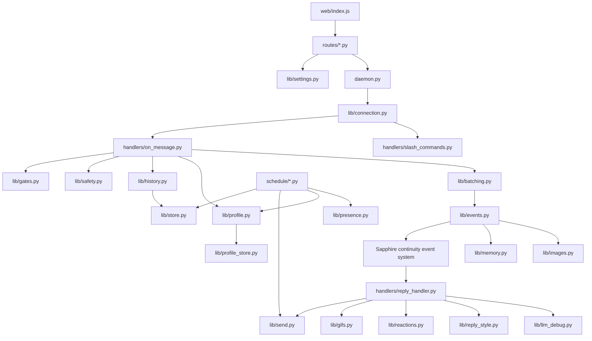
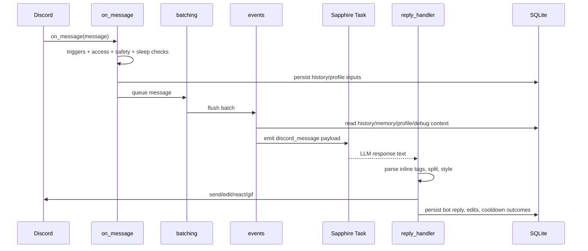

# Leona Discord Plugin Review

> Review target: `plugins/leona_discord/` in the current workspace, not the archived `leona_discord_rev*.zip` files.
>
> Assumption: the live folder is the canonical version because it is newer, editable, and already contains the same broad feature set as `rev8`. Where behavior is inferred rather than proven by runtime execution, that is called out explicitly.

# 1. Executive Summary

`plugins/leona_discord` is a large, self-contained Discord bot plugin for Sapphire. It is not just a message bridge. It is a full behavioral layer that connects one or more Discord bot accounts to Sapphire's daemon event system, batches messages, enriches prompts with history and memory, routes replies back into Discord, and simulates a more human conversational style through typing delays, reactions, edits, GIFs, quiet-hours logic, sleep schedules, and user profiling.

Its overall purpose is to make Sapphire participate in Discord as a personality-driven social bot instead of a raw command bot. It solves several problems at once:

- turning Discord into a Sapphire continuity event source
- preventing spammy "one reply per message" behavior through batching
- preserving conversational continuity with local channel memory
- preserving relationship context with per-user profiles
- giving the bot human-like presence and timing
- exposing Discord actions to the LLM through tools without requiring the stock `plugins/discord`

It integrates with the rest of the project through:

- Sapphire's plugin manifest system via `plugins/leona_discord/plugin.json`
- Sapphire's daemon lifecycle via `plugins/leona_discord/daemon.py`
- Sapphire continuity event routing via emitted `discord_message` events
- Sapphire's route registration for settings/admin APIs under `routes/`
- Sapphire's schedule/cron system for proactive jobs under `schedule/`
- Sapphire's settings UI through `web/index.js`
- Sapphire's execution context and LLM provider stack, especially for image support and LLM generation

The plugin is architecturally strong in breadth and behavior, but also highly coupled. Rebuilding it cleanly would require preserving the behavior while separating runtime state, storage, prompt enrichment, Discord I/O, and proactive scheduling into clearer services.

# 2. Folder and File Structure

## Tree

```text
plugins/leona_discord/
├── .git/
│   ├── COMMIT_EDITMSG
│   ├── HEAD
│   ├── config
│   ├── description
│   ├── cursor/
│   │   └── crepe/.../metadata.json
│   ├── hooks/
│   │   └── *.sample
│   ├── info/
│   │   └── exclude
│   ├── logs/
│   │   ├── HEAD
│   │   └── refs/...
│   ├── objects/
│   │   └── <git blob/object files>
│   └── refs/
│       ├── heads/main
│       └── remotes/origin/main
├── .gitignore
├── CHANGELOG.md
├── EMOJIS.md
├── README.md
├── Roadmap.md
├── _compat.py
├── configuration_guide.md
├── core_patch_required.md
├── daemon.py
├── emojis.py
├── handlers/
│   ├── __init__.py
│   ├── on_message.py
│   ├── reply_handler.py
│   └── slash_commands.py
├── lib/
│   ├── __init__.py
│   ├── activity.py
│   ├── auto_typo.py
│   ├── batching.py
│   ├── bot_identity.py
│   ├── connection.py
│   ├── constants.py
│   ├── context_cache.py
│   ├── cooldowns.py
│   ├── core_compat.py
│   ├── edit_history.py
│   ├── embeds.py
│   ├── emoji_policy.py
│   ├── engagement.py
│   ├── events.py
│   ├── gates.py
│   ├── gif_query_llm.py
│   ├── gif_search.py
│   ├── gifs.py
│   ├── goodnight_llm.py
│   ├── greeting_llm.py
│   ├── history.py
│   ├── images.py
│   ├── inline_tags.py
│   ├── llm_debug.py
│   ├── memory.py
│   ├── mentions.py
│   ├── messages.py
│   ├── outreach_llm.py
│   ├── paths.py
│   ├── presence.py
│   ├── presets.py
│   ├── proactive_guard.py
│   ├── proactive_llm.py
│   ├── profile.py
│   ├── profile_distill_llm.py
│   ├── profile_store.py
│   ├── reactions.py
│   ├── reply_context.py
│   ├── reply_style.py
│   ├── safety.py
│   ├── schedule_utils.py
│   ├── send.py
│   ├── settings.py
│   ├── sleep_buffer.py
│   ├── sleep_forced_wake.py
│   ├── sleep_schedule.py
│   ├── state.py
│   ├── store.py
│   ├── style_hint.py
│   ├── think_tags.py
│   ├── trace.py
│   ├── typo_wordlist.py
│   └── typing_indicator.py
├── plugin.json
├── routes/
│   ├── accounts.py
│   ├── profiles.py
│   ├── settings.py
│   └── traces.py
├── schedule/
│   ├── forced_wake_test.py
│   ├── morning_greeting.py
│   ├── profile_distill.py
│   ├── quiet_outreach.py
│   └── sleep_goodnight.py
├── statuses/
│   ├── awake.json
│   └── sleep.json
├── tests/
│   └── test_pure_logic.py
├── tools/
│   └── discord_tools.py
├── user_profiling_design.md
└── web/
    └── index.js
```

## Detailed File Notes

### Root

- `plugins/leona_discord/plugin.json`
  - Purpose: plugin manifest and integration contract.
  - Responsibilities: declares metadata, Python dependencies, settings UI type, tools, daemon entry, event source, routes, schedule jobs.
  - Dependencies: Sapphire plugin loader, route/daemon registration, schedule system.
  - Notes: active and authoritative for integration. Declares version `1.5.7`.

- `plugins/leona_discord/daemon.py`
  - Purpose: runtime entrypoint.
  - Responsibilities: daemon start/stop, event loop creation, Discord account connection, reply handler registration, subsystem startup/shutdown, presence maintenance.
  - Dependencies: `handlers.reply_handler`, `lib.connection`, `lib.state`, `lib.memory`, `lib.profile`, `lib.batching`, `lib.core_compat`.
  - Notes: central lifecycle file. Re-exports compatibility helpers for routes/tools.

- `plugins/leona_discord/_compat.py`
  - Purpose: portable import bootstrap.
  - Responsibilities: ensure imports work whether plugin lives under `plugins/` or `user/plugins/`.
  - Dependencies: Python import machinery.
  - Notes: runtime support file, not optional.

- `plugins/leona_discord/emojis.py`
  - Purpose: default allowed emoji dataset.
  - Responsibilities: exports Unicode emoji list used by settings/reaction policy.
  - Dependencies: reaction settings and policy modules.
  - Notes: data-only module.

- `plugins/leona_discord/README.md`
  - Purpose: high-level operator and developer overview.
  - Responsibilities: installation, setup, major feature summary, file map.
  - Dependencies: references docs and implementation files.
  - Notes: active documentation; broadly accurate.

- `plugins/leona_discord/configuration_guide.md`
  - Purpose: full settings guide.
  - Responsibilities: explain UI tabs, effective settings layering, triggers, sleep, outreach, memory, profiles, tools, slash commands, proactive jobs.
  - Dependencies: mirrors `lib/settings.py`, routes, and UI.
  - Notes: one of the best non-code references for intended behavior.

- `plugins/leona_discord/CHANGELOG.md`
  - Purpose: release history.
  - Responsibilities: track feature evolution.
  - Dependencies: none at runtime.
  - Notes: useful for migration context.

- `plugins/leona_discord/Roadmap.md`
  - Purpose: shipped vs planned work.
  - Responsibilities: record technical direction and missing features.
  - Dependencies: references many active modules.
  - Notes: not runtime, but important for distinguishing finished behavior from aspirations.

- `plugins/leona_discord/user_profiling_design.md`
  - Purpose: design and status appendix for user profiling.
  - Responsibilities: explain profile layers, shipped phases, open items.
  - Dependencies: `lib/profile.py`, `lib/profile_store.py`, `schedule/profile_distill.py`.
  - Notes: clarifies some code/doc mismatches.

- `plugins/leona_discord/EMOJIS.md`
  - Purpose: emoji reference.
  - Responsibilities: provide human-readable emoji catalog/reference for reaction work.
  - Dependencies: indirectly related to emoji policy and settings.
  - Notes: reference doc, not runtime.

- `plugins/leona_discord/core_patch_required.md`
  - Purpose: explain required Sapphire core compatibility patching.
  - Responsibilities: documents why image support depends on core behavior.
  - Dependencies: `lib/core_compat.py`.
  - Notes: critical design warning for rebuilders.

- `plugins/leona_discord/.gitignore`
  - Purpose: source control hygiene.
  - Responsibilities: ignore caches/temp artifacts.
  - Dependencies: Git only.
  - Notes: non-runtime.

### `handlers/`

- `plugins/leona_discord/handlers/__init__.py`
  - Purpose: package marker.
  - Responsibilities: make package importable.
  - Dependencies: none.
  - Notes: trivial.

- `plugins/leona_discord/handlers/on_message.py`
  - Purpose: Discord message ingress.
  - Responsibilities: trigger detection, access checks, safety checks, sleep logic, persistence, profile ingest, reactions, engagement adjustment, batching.
  - Dependencies: many `lib/*` modules, especially `gates`, `history`, `store`, `profile`, `batching`.
  - Notes: one of the most important files in the plugin. High coupling.

- `plugins/leona_discord/handlers/reply_handler.py`
  - Purpose: outbound reply delivery.
  - Responsibilities: parse LLM output, strip tags, split messages, simulate typing, send chunks, apply edits, add reactions, send GIFs, update cooldown/history/profile state.
  - Dependencies: `lib.inline_tags`, `lib.reply_style`, `lib.send`, `lib.messages`, `lib.gifs`, `lib.typing_indicator`, `tools.discord_tools`.
  - Notes: second major pipeline hub.

- `plugins/leona_discord/handlers/slash_commands.py`
  - Purpose: native Discord slash commands.
  - Responsibilities: register `/ask`, `/summarize`, `/remember`, `/forget-me`; emit event payloads or mutate memory/profile state.
  - Dependencies: `discord.app_commands`, `lib.events`, `lib.profile`, `lib.store`, `lib.history`, `lib.bot_identity`.
  - Notes: active user-facing integration.

### `routes/`

- `plugins/leona_discord/routes/accounts.py`
  - Purpose: bot account management API.
  - Responsibilities: list/add/delete/test account tokens and metadata.
  - Dependencies: plugin state, daemon connection helpers.
  - Notes: security-sensitive because it handles account credentials.

- `plugins/leona_discord/routes/settings.py`
  - Purpose: settings/admin API.
  - Responsibilities: read/write global and per-server settings, validate/clamp values, list guilds/channels, expose proactive test endpoints, expose presence/status helper data.
  - Dependencies: `lib.settings`, `lib.presets`, `lib.presence`, `lib.reply_context`, schedule/test modules, daemon state.
  - Notes: large API surface and de facto settings schema.

- `plugins/leona_discord/routes/profiles.py`
  - Purpose: profile inspection/reset API.
  - Responsibilities: list profiles, reset a user profile, run distillation manually.
  - Dependencies: `lib.profile_store`, `schedule.profile_distill`.
  - Notes: operational/admin surface, not part of reply loop.

- `plugins/leona_discord/routes/traces.py`
  - Purpose: debug API.
  - Responsibilities: expose traces, LLM debug logs, memory stats.
  - Dependencies: `lib.store`, `lib.llm_debug`, `lib.memory`.
  - Notes: observability surface for tuning/debugging.

### `schedule/`

- `plugins/leona_discord/schedule/morning_greeting.py`
  - Purpose: morning greeting cron.
  - Responsibilities: choose targets, generate greeting, send greeting, wake channels, drain buffered sleep mentions.
  - Dependencies: `lib.greeting_llm`, `lib.schedule_utils`, `lib.sleep_schedule`, `lib.store`, `lib.send`.
  - Notes: proactive feature.

- `plugins/leona_discord/schedule/quiet_outreach.py`
  - Purpose: quiet-channel outreach cron.
  - Responsibilities: detect quiet channels, skip under disallowed conditions, generate outreach text, send message, update outreach cooldown.
  - Dependencies: `lib.outreach_llm`, `lib.proactive_guard`, `lib.store`, `lib.sleep_schedule`, `lib.history`.
  - Notes: another proactive feature, tied closely to prior activity history.

- `plugins/leona_discord/schedule/sleep_goodnight.py`
  - Purpose: sleep/goodnight cron.
  - Responsibilities: decide nightly firing minute, post goodnight, mark channel asleep.
  - Dependencies: `lib.goodnight_llm`, `lib.sleep_schedule`, `lib.store`.
  - Notes: part of stronger sleep-state system.

- `plugins/leona_discord/schedule/profile_distill.py`
  - Purpose: background profile distillation worker.
  - Responsibilities: dequeue pending profile work, call profile distiller, update profile summaries/facts/dispositions, apply decay.
  - Dependencies: `lib.profile`, `lib.profile_store`, `lib.profile_distill_llm`.
  - Notes: key to relationship memory.

- `plugins/leona_discord/schedule/forced_wake_test.py`
  - Purpose: synthetic forced-wake test helper.
  - Responsibilities: simulate forced-wake routing from the settings UI.
  - Dependencies: `lib.events`, `lib.sleep_forced_wake`, `lib.store`.
  - Notes: diagnostic support, not normal bot behavior.

### `tools/`

- `plugins/leona_discord/tools/discord_tools.py`
  - Purpose: LLM-callable Discord toolset.
  - Responsibilities: server listing, channel reading, message sending, file upload, GIF sending, reactions; prevent duplicate send path conflicts.
  - Dependencies: daemon state, `lib.send`, `lib.gifs`, `lib.messages`, `lib.mentions`, `lib.emoji_policy`.
  - Notes: critical for tool-mediated Discord actions and a major security boundary.

### `statuses/`

- `plugins/leona_discord/statuses/awake.json`
  - Purpose: default awake presence preset catalog.
  - Responsibilities: define built-in selectable activity/status entries.
  - Dependencies: `lib.presence`, UI.
  - Notes: user-editable runtime data.

- `plugins/leona_discord/statuses/sleep.json`
  - Purpose: sleep-only custom statuses.
  - Responsibilities: define rotating sleep-state status texts.
  - Dependencies: `lib.presence`.
  - Notes: user-editable runtime data.

### `tests/`

- `plugins/leona_discord/tests/test_pure_logic.py`
  - Purpose: logic-level regression suite.
  - Responsibilities: test parsing, gating, timing helpers, sentiment/emoji policy, batching pieces, sleep helpers, presence parsing, profile utilities, bot identity helpers.
  - Dependencies: many `lib/*` modules.
  - Notes: valuable breadth for pure functions, but not an end-to-end integration suite.

### `web/`

- `plugins/leona_discord/web/index.js`
  - Purpose: settings/admin frontend.
  - Responsibilities: render tabbed UI, fetch settings/accounts/servers/channels/profiles/traces, submit mutations, trigger tests, present debug popups.
  - Dependencies: route endpoints declared in `plugin.json`.
  - Notes: very large single file; functionally rich, structurally dense.

### `lib/` overview

All `lib/*` files are active unless stated otherwise. The folder is the actual application layer.

- `lib/__init__.py`: package marker.
- `lib/constants.py`: shared constants such as defaults and limits.
- `lib/state.py`: shared mutable global runtime state; foundational and tightly coupled.
- `lib/settings.py`: settings defaults and effective merge rules.
- `lib/presets.py`: personality preset definitions.
- `lib/connection.py`: Discord client connection lifecycle.
- `lib/batching.py`: per-channel message batching and flush flow.
- `lib/events.py`: build and emit enriched continuity events.
- `lib/store.py`: main SQLite store for messages, traces, pinned memories, sleep state, outreach cooldowns.
- `lib/profile_store.py`: profile-specific tables and persistence helpers.
- `lib/profile.py`: profile ingest, recall, engagement modulation.
- `lib/profile_distill_llm.py`: LLM-based fact/summary extraction.
- `lib/history.py`: in-memory and SQLite-backed channel history handling.
- `lib/memory.py`: channel-memory recall injection.
- `lib/llm_debug.py`: prompt/response/post-edit debug capture.
- `lib/images.py`: image URL collection, fetch/resize/description, multimodal support.
- `lib/gates.py`: reply/reaction eligibility logic.
- `lib/safety.py`: permissions, content blocklist, rate limiting.
- `lib/reactions.py`: silent reaction engine and humanized reaction timing.
- `lib/gifs.py`: GIF follow-up orchestration.
- `lib/gif_search.py`: GIF provider integrations.
- `lib/gif_query_llm.py`: short GIF query generation.
- `lib/proactive_llm.py`: shared proactive LLM wrapper.
- `lib/greeting_llm.py`: morning greeting generation.
- `lib/goodnight_llm.py`: goodnight generation.
- `lib/outreach_llm.py`: quiet-channel outreach generation.
- `lib/presence.py`: presence presets, quiet-hours behavior, LLM status generation, Discord presence application.
- `lib/sleep_schedule.py`: asleep/wake state helpers and timing.
- `lib/sleep_forced_wake.py`: repeated-mention wake logic and forced-wake hints.
- `lib/sleep_buffer.py`: helpers around delayed wake replies.
- `lib/typing_indicator.py`: typing simulation durations and hold behavior.
- `lib/send.py`: low-level send/edit wrappers.
- `lib/messages.py`: message chunking and snowflake parsing.
- `lib/reply_style.py`: quote-reply choice, post-send edits, casual emoji choices.
- `lib/inline_tags.py`: parse and sanitize `[react:]`, `[gif:]`, `[edit:]`.
- `lib/edit_history.py`: record/edit history and build prompt hints.
- `lib/mentions.py`: mention mapping and custom emoji resolution.
- `lib/emoji_policy.py`: emoji allowlist enforcement.
- `lib/engagement.py`: topic tracking, thread boosts, reply length tracking, engagement adjustments.
- `lib/cooldowns.py`: cooldown and engagement window state.
- `lib/context_cache.py`: pending payload, reply context, and reaction-dedup caches.
- `lib/activity.py`: activity-decay tracking.
- `lib/bot_identity.py`: self-identity prompt enrichment and self-greeting fixes.
- `lib/trace.py`: trace object for gated decision logging.
- `lib/reply_context.py`: sync settings with Sapphire reply-context limits/history.
- `lib/core_compat.py`: Sapphire-core monkey patch for execution context image support.
- `lib/auto_typo.py`: explicit auto-typo planning.
- `lib/typo_wordlist.py`: typo replacement dataset.
- `lib/think_tags.py`: remove model "thinking" markers.
- `lib/style_hint.py`: style-prompt helpers.
- `lib/proactive_guard.py`: coordination and guardrails for proactive sends.
- `lib/paths.py`: plugin data path resolution.
- `lib/embeds.py`: embed construction and color parsing.
- `lib/schedule_utils.py`: target parsing and schedule send helpers.

### Embedded `.git/`

The plugin folder contains an embedded standalone Git repository and editor metadata:

- `plugins/leona_discord/.git/HEAD`
- `plugins/leona_discord/.git/config`
- `plugins/leona_discord/.git/description`
- `plugins/leona_discord/.git/COMMIT_EDITMSG`
- `plugins/leona_discord/.git/refs/**`
- `plugins/leona_discord/.git/logs/**`
- `plugins/leona_discord/.git/objects/**`
- `plugins/leona_discord/.git/hooks/*.sample`
- `plugins/leona_discord/.git/info/exclude`
- `plugins/leona_discord/.git/cursor/**/metadata.json`

These files are not runtime dependencies. They are VCS/editor artifacts and should not be recreated in a clean rewrite or distribution package.

# 3. Architecture

## Overall Architecture

The plugin uses an event-driven, daemon-based architecture with local persistence and shared module-level state.

Main architectural layers:

1. Discord runtime layer
   - `daemon.py`
   - `lib/connection.py`
   - `handlers/on_message.py`
   - `handlers/slash_commands.py`

2. Enrichment and decision layer
   - `lib/gates.py`
   - `lib/safety.py`
   - `lib/batching.py`
   - `lib/events.py`
   - `lib/history.py`
   - `lib/memory.py`
   - `lib/profile.py`
   - `lib/images.py`

3. Delivery layer
   - `handlers/reply_handler.py`
   - `lib/send.py`
   - `lib/reactions.py`
   - `lib/gifs.py`
   - `lib/reply_style.py`

4. Proactive/scheduled behavior layer
   - `schedule/*.py`
   - `lib/presence.py`
   - `lib/sleep_schedule.py`
   - `lib/sleep_forced_wake.py`
   - `lib/proactive_llm.py`

5. Persistence and observability layer
   - `lib/store.py`
   - `lib/profile_store.py`
   - `lib/llm_debug.py`
   - `lib/trace.py`

6. Admin/UI layer
   - `routes/*.py`
   - `web/index.js`

## Design Patterns Used

- Daemon thread with dedicated `asyncio` loop
- Event-driven pipeline using Sapphire daemon events
- Shared-state singleton pattern through `lib/state.py`
- Repository-like storage helpers in `lib/store.py` and `lib/profile_store.py`
- Strategy-like configurable behavior through settings/presets
- Adapter pattern around Discord APIs, GIF providers, and Sapphire LLM providers
- Soft state machines for quiet hours, sleep, forced wake, and profile distillation

## Module Relationships



## Data Flow



## Event Flow

### Incoming events

- Discord `on_message`
- Discord `on_typing`
- Discord slash command interactions
- Sapphire cron schedule executions

### Emitted events

- `discord_message`
  - source: plugin daemon event source declared in `plugin.json`
  - consumer: Sapphire continuity/schedule tasks configured by the user
  - payload: account/channel/user/message context, prompt text, history, memory/profile hints, image info, reply target metadata

## Lifecycle

### Initialization process

1. Sapphire loads plugin manifest from `plugin.json`.
2. Sapphire starts daemon via `daemon.py:start(plugin_loader, settings)`.
3. `daemon.py` warns if `core.asyncio_shutdown` compatibility is missing.
4. Shared lifecycle state is set in `lib/state.py`.
5. A dedicated `asyncio` loop is created in a daemon thread.
6. Reply handler `leona_discord` is registered with Sapphire.
7. `lib/core_compat.py` patches execution-context image support if needed.
8. `lib.memory.start()` and `lib.profile.start()` initialize storage-related services.
9. Background loop calls `lib.connection.connect_accounts()`.
10. One `discord.py` client per configured account is created and started.
11. `handlers.on_message` and `handlers.slash_commands` are registered.
12. `on_ready` syncs slash commands and persists connected bot metadata.

### Runtime lifecycle

- messages arrive and are handled continuously
- scheduled jobs run independently on cron intervals
- presence is refreshed in the daemon loop
- SQLite is opened lazily and reused
- in-memory caches hold mention maps, batches, pending payloads, cooldowns, and reacted-message state

### Shutdown process

1. Sapphire calls `daemon.py:stop()`.
2. Stop event is set.
3. Pending batches are flushed via `flush_all_pending()`.
4. memory/profile services are stopped.
5. Connected Discord clients are closed on the daemon loop.
6. loop thread is joined with timeout.
7. mention maps, pending payloads, and reaction dedupe caches are cleared.
8. `core.asyncio_shutdown.close_event_loop()` is called if available.

Notes:

- Shutdown is functional but not elegantly encapsulated.
- Broad exception swallowing makes shutdown resilient but opaque.

# 4. Configuration

## Configuration files

- `plugins/leona_discord/plugin.json`
  - manifest, routes, schedules, dependencies
- `plugins/leona_discord/statuses/awake.json`
  - default awake presence presets
- `plugins/leona_discord/statuses/sleep.json`
  - sleep-mode custom statuses
- `plugins/leona_discord/configuration_guide.md`
  - operator documentation

## Runtime settings storage

Runtime settings are persisted in Sapphire plugin state, not in a separate plugin-owned JSON config file. The effective values are computed in `plugins/leona_discord/lib/settings.py`.

Storage layout inferred from code:

- top-level plugin state fields:
  - `batch_delay`
  - `always_online`
  - `debug_trace_enabled`
  - `llm_debug_messaging_enabled`
  - `gif_api_key`
  - `gif_provider`
  - `dm`
  - `llm_max_history`
  - `reply_context_limit`
- nested fields:
  - `global`
  - `servers`

## Environment variables

No plugin-specific environment variables are defined in the reviewed code. External providers may rely on Sapphire/global environment configuration, but that is outside this plugin.

## Important defaults

Defaults are defined primarily in `plugins/leona_discord/lib/settings.py`.

Examples:

- `human_response_chance`: `15`
- `bot_response_chance`: `15`
- `cooldown_seconds`: `120`
- `cooldown_scope`: `per_channel`
- `reaction_chance`: `50`
- `reaction_cooldown_seconds`: `30`
- `image_enabled`: `False`
- `memory_enabled`: `True`
- `memory_max_tokens`: `300`
- `profiling_enabled`: `False`
- `profiling_min_messages`: `5`
- `reply_mode`: `default`
- `presence_cycling_enabled`: `True`
- `presence_cycle_interval_minutes`: `10`
- `quiet_hours_enabled`: `False`
- `greeting_enabled`: `False`
- `sleep_schedule_enabled`: `False`
- `outreach_enabled`: `False`
- `gif_replies_enabled`: `False`
- `slash_commands_enabled`: `True`
- `message_edits_enabled`: `True`
- `auto_typo_enabled`: `False`

DM defaults:

- `human_response_chance`: `25`
- `bot_response_chance`: `0`
- `reaction_chance`: `40`
- `cooldown_seconds`: `60`

## Required settings

To function minimally:

- at least one bot account with valid token via `routes/accounts.py`
- Discord bot must have `Message Content Intent`
- bot must be invited with `bot` and `applications.commands` scopes
- Sapphire must have a schedule task listening to `discord_message` with `auto_reply` enabled if conversational channel replies are desired

## Optional settings

Optional but significant:

- image understanding provider/model
- profile distillation model
- greeting/goodnight/outreach models
- GIF provider/API key
- profiling toggles
- presence LLM status chance
- per-server overrides
- quiet hours and sleep behavior

# 5. Features

## 5.1 Multi-account Discord connections

- Description: support multiple named bot accounts.
- Purpose: allow more than one bot persona/account to connect.
- Internals: `lib.connection.py` reads configured accounts and starts one `discord.Client` per token.
- Files: `daemon.py`, `lib/connection.py`, `routes/accounts.py`, `plugin.json`
- Functions/classes: `connect_accounts()`, `connect_single()`
- Dependencies: `discord.py`, plugin state
- User-facing behavior: accounts can be added/tested via settings UI and may connect automatically.
- Limitations: tied to shared global runtime state; restart/reconnect logic is basic.

## 5.2 Message batching

- Description: channel messages are grouped into a single delayed reply batch.
- Purpose: avoid answering every line independently and produce more natural responses.
- Internals: `lib/batching.py` maintains per-channel batch objects and timers, then emits a single event payload.
- Files: `handlers/on_message.py`, `lib/batching.py`, `lib/events.py`, `lib/typing_indicator.py`
- Functions/classes: `MessageBatch`, `get_or_create_batch()`, `queue_message()`, `flush_batch()`
- Dependencies: shared state, typing indicator, history/memory/profile injection
- User-facing behavior: bot waits before responding and may answer multiple quick messages together.
- Limitations: batch state is in process memory; timing is heuristic rather than exact.

## 5.3 Conversational reply routing through Sapphire tasks

- Description: replies are generated by Sapphire tasks, not directly in the Discord handler.
- Purpose: reuse Sapphire LLM execution pipeline and tools.
- Internals: `lib/events.py` emits a `discord_message` event; `handlers/reply_handler.py` receives the task result and posts to Discord.
- Files: `plugin.json`, `lib/events.py`, `handlers/reply_handler.py`
- Functions/classes: `build_event_payload()`, `emit_event()`, `reply_handler()`
- Dependencies: Sapphire continuity event system
- User-facing behavior: normal chat replies appear in Discord if an accepting task is configured.
- Limitations: without a matching Schedule task, the bot can connect/react/slash-command but not post normal LLM replies.

## 5.4 Trigger detection and reply gating

- Description: bot decides whether a message deserves reply, reaction, or silence.
- Purpose: make behavior configurable and less intrusive.
- Internals: `lib/gates.py` evaluates mentions, name match, keywords, roles, cooldowns, reply modes, and chance rolls.
- Files: `handlers/on_message.py`, `lib/gates.py`, `lib/settings.py`, `lib/safety.py`
- Functions/classes: `evaluate_triggers()`, `should_queue_reply()`, `check_user_access()`
- Dependencies: settings, cooldowns, safety, engagement
- User-facing behavior: `@mentions` usually force replies; random organic replies obey chances and modes.
- Limitations: logic is spread across several modules.

## 5.5 Safety checks

- Description: permissions, rate limiting, and content blocklist checks.
- Purpose: reduce spam and unsafe posting.
- Internals: `lib/safety.py` runs checks before queueing replies.
- Files: `handlers/on_message.py`, `lib/safety.py`, `lib/settings.py`
- Functions/classes: `run_safety_checks()`
- Dependencies: settings, Discord permission state
- User-facing behavior: blocked messages silently fail to produce replies; traces can explain why.
- Limitations: broad fail-soft behavior can hide errors if debug traces are off.

## 5.6 Silent reactions

- Description: bot may react without sending text.
- Purpose: lurker-like participation.
- Internals: `lib.reactions.py` chooses humanized reactions using settings, sentiment, and emoji policy.
- Files: `handlers/on_message.py`, `lib/reactions.py`, `lib/emoji_policy.py`, `emojis.py`
- Functions/classes: `try_silent_react()`, `add_reaction_humanized()`
- Dependencies: `vaderSentiment`, optionally `transformers`/`torch`
- User-facing behavior: messages may receive emoji reactions even when not replied to.
- Limitations: sentiment quality depends on selected backend; custom emoji must be allowlisted.

## 5.7 GIF follow-ups

- Description: send GIFs after a text reply or by explicit tag/tool.
- Purpose: more expressive social responses.
- Internals: `lib.gifs.py` decides whether and how to send a GIF, optionally using `lib.gif_query_llm.py` and `lib.gif_search.py`.
- Files: `handlers/reply_handler.py`, `lib/gifs.py`, `lib/gif_query_llm.py`, `lib/gif_search.py`, `tools/discord_tools.py`
- Functions/classes: `try_gif_followup()`, `send_gif_query()`
- Dependencies: GIF provider APIs, optional LLM query generation
- User-facing behavior: occasional or explicit GIF messages appear after bot replies.
- Limitations: provider configuration and API availability matter.

## 5.8 Humanized typing, pauses, and chunking

- Description: bot waits, types, and splits output more like a person.
- Purpose: reduce robotic feel.
- Internals: `lib.typing_indicator.py` computes pauses and typing durations; `lib.messages.py` splits long text; `reply_handler.py` sequences chunk sending.
- Files: `handlers/reply_handler.py`, `lib.typing_indicator.py`, `lib/messages.py`
- Functions/classes: `human_pause_seconds()`, `typing_duration_seconds()`, `split_message()`
- Dependencies: daemon event loop and Discord typing APIs
- User-facing behavior: delays before replies, typing indicator, multi-part messages.
- Limitations: all timing is heuristic and blocking in places.

## 5.9 Quote-reply heuristics

- Description: bot may reply to a specific triggering message instead of sending plain channel text.
- Purpose: preserve context in busy channels.
- Internals: `lib.reply_style.py` decides whether quote-reply is appropriate.
- Files: `handlers/reply_handler.py`, `lib/reply_style.py`
- Functions/classes: `should_quote_reply()`
- Dependencies: event metadata and message style heuristics
- User-facing behavior: some replies appear as native Discord reply chains.
- Limitations: heuristic, not deterministic.

## 5.10 Inline LLM tags

- Description: model can request actions using `[react:]`, `[gif:]`, `[edit:]`, `[break]`.
- Purpose: give the model limited structured control over delivery style.
- Internals: `lib.inline_tags.py` parses tags; `reply_handler.py` applies them.
- Files: `lib/inline_tags.py`, `handlers/reply_handler.py`
- Functions/classes: `parse_inline_tags()`, `sanitize_discord_text()`, `ParsedInlineTags`
- Dependencies: reaction/GIF/edit subsystems
- User-facing behavior: bot can react, send GIFs, split messages, or correct itself after sending.
- Limitations: malformed tags are handled defensively, but tags still expose complexity to prompts.

## 5.11 Post-send edits and auto typos

- Description: bot can intentionally send a typo-like message and then correct it, or append an afterthought.
- Purpose: simulate human imperfection.
- Internals: `lib.auto_typo.py`, `lib.reply_style.py`, `lib.edit_history.py`
- Files: `handlers/reply_handler.py`, `lib/auto_typo.py`, `lib/reply_style.py`, `lib/edit_history.py`, `lib/typo_wordlist.py`
- Functions/classes: `plan_auto_typo()`, `plan_post_send_edit()`, `plan_explicit_edit()`
- Dependencies: message edits enabled, send/edit APIs
- User-facing behavior: occasional self-correction or deliberate typo correction.
- Limitations: only one of several edit paths is chosen; logic is nontrivial and partly random.

## 5.12 Channel history and memory recall

- Description: plugin stores channel history and retrieves relevant prior messages.
- Purpose: keep continuity across restarts and long conversations.
- Internals: SQLite-backed history in `lib.store.py`, in-memory formatting in `lib.history.py`, keyword-based retrieval in `lib.memory.py`.
- Files: `lib/store.py`, `lib/history.py`, `lib/memory.py`, `lib/events.py`
- Functions/classes: `save_message()`, `get_recent_messages()`, `search_memory()`, `recall_context()`
- Dependencies: SQLite
- User-facing behavior: replies reference previous channel context naturally.
- Limitations: retrieval is keyword/recency based, not true embeddings.

## 5.13 Pinned memory

- Description: explicit saved notes per account/guild/channel.
- Purpose: preserve important facts beyond normal history.
- Internals: `pinned_memories` table in SQLite; `/remember` writes to it.
- Files: `lib/store.py`, `handlers/slash_commands.py`
- Functions/classes: `save_pinned_memory()`, `get_pinned_memories()`
- Dependencies: SQLite
- User-facing behavior: `/remember` stores information for later recall.
- Limitations: retrieval quality depends on memory injection logic.

## 5.14 User profiling

- Description: per-user relationship memory and disposition tracking.
- Purpose: let the bot remember who someone is and modulate tone/interest accordingly.
- Internals: `lib/profile.py` ingests messages/outcomes, `lib/profile_store.py` stores profile rows and facts, `lib.profile_distill_llm.py` extracts higher-order summaries.
- Files: `lib/profile.py`, `lib/profile_store.py`, `lib/profile_distill_llm.py`, `schedule/profile_distill.py`, `routes/profiles.py`, `user_profiling_design.md`
- Functions/classes: `record_user_message()`, `record_bot_reply()`, `recall_user_context()`, `save_user_fact()`, `forget_user()`
- Dependencies: SQLite, optional LLM model for distillation
- User-facing behavior: bot may feel more familiar or tailored over time; profile data is visible in Profiles UI.
- Limitations: disabled by default; some roadmap ambitions remain unfinished.

## 5.15 Profile distillation

- Description: background LLM extraction of facts/summaries/disposition deltas.
- Purpose: turn raw interaction buffers into compact relationship memory.
- Internals: cron-driven distillation pipeline flushes pending buffers and updates profile tables.
- Files: `schedule/profile_distill.py`, `lib/profile_store.py`, `lib/profile_distill_llm.py`
- Functions/classes: distillation queue and merge helpers
- Dependencies: LLM provider availability
- User-facing behavior: profile summaries/facts improve without manual intervention.
- Limitations: cost/latency sensitive; partially dependent on model reliability.

## 5.16 Image understanding and multimodal support

- Description: detect image URLs/attachments and generate text descriptions or multimodal payloads.
- Purpose: allow a text LLM or mixed Sapphire stack to respond to image-bearing messages.
- Internals: `lib.images.py` collects image URLs, fetches media, shrinks/encodes if needed, builds descriptions or event images.
- Files: `handlers/on_message.py`, `lib/images.py`, `lib/core_compat.py`
- Functions/classes: image collection and describe/build helpers
- Dependencies: `requests`, Pillow, Sapphire execution context, image-capable model/provider
- User-facing behavior: bot can comment meaningfully on shared images.
- Limitations: depends on core patch behavior and configured model support.

## 5.17 Slash commands

- Description: native app commands for ask/summarize/memory erasure.
- Purpose: direct command-driven interaction inside Discord.
- Internals: implemented in `handlers/slash_commands.py`; emit standard events or mutate profile/memory.
- Files: `handlers/slash_commands.py`, `lib/events.py`, `lib.history.py`, `lib.profile.py`, `lib.store.py`
- Functions/classes: `ask_cmd`, `summarize_cmd`, `remember_cmd`, `forget_me_cmd`
- Dependencies: `discord.app_commands`
- User-facing behavior: slash commands appear in Discord once synced.
- Limitations: `/ask` and `/summarize` still depend on a listening Sapphire task for actual channel replies.

## 5.18 Proactive greetings

- Description: scheduled morning posts to selected channels.
- Purpose: ambient community presence.
- Internals: hourly cron checks wake hour, generates greeting using dedicated/shared model path, sends to targets.
- Files: `schedule/morning_greeting.py`, `lib/greeting_llm.py`, `lib/proactive_llm.py`, `lib/schedule_utils.py`
- Functions/classes: `run_greeting()` and helpers
- Dependencies: schedules, configured greeting targets, LLM optional
- User-facing behavior: one greeting per day at configured time.
- Limitations: skipped during quiet hours; depends on target configuration.

## 5.19 Sleep schedule and goodnight

- Description: stronger silence mode with goodnight posts and delayed wake handling.
- Purpose: model a bot that "sleeps" rather than merely being less chatty.
- Internals: `lib.sleep_schedule.py` and `schedule/sleep_goodnight.py` persist asleep state, schedule one nightly minute, and wake later.
- Files: `schedule/sleep_goodnight.py`, `lib/sleep_schedule.py`, `lib/store.py`, `lib/goodnight_llm.py`
- Functions/classes: sleep-state helpers and nightly run functions
- Dependencies: SQLite, schedules, optional LLM
- User-facing behavior: goodnight message, dormancy, morning wake behavior.
- Limitations: channel-target logic is complex and stateful.

## 5.20 Forced wake

- Description: repeated direct mentions while asleep temporarily wake the bot.
- Purpose: let urgent pings override sleep.
- Internals: buffer mentions in SQLite, count rolling mention window, inject grumpy wake hint, suppress replay of already answered mentions.
- Files: `handlers/on_message.py`, `lib/sleep_forced_wake.py`, `lib/store.py`, `schedule/forced_wake_test.py`
- Functions/classes: `handle_sleep_mention()`, `wrap_forced_wake_content()`
- Dependencies: sleep buffer tables and event pipeline
- User-facing behavior: repeated pings can get an annoyed awake response.
- Limitations: only direct mentions count.

## 5.21 Quiet-channel outreach

- Description: proactive conversation starters when a configured channel has gone quiet.
- Purpose: keep social momentum going.
- Internals: every 15 minutes, eligible channels are filtered by history, cooldown, quiet hours, sleep state, greeting coordination, and skip chance.
- Files: `schedule/quiet_outreach.py`, `lib/outreach_llm.py`, `lib/proactive_guard.py`, `lib/store.py`
- Functions/classes: outreach run helpers
- Dependencies: history, schedules, LLM optional
- User-facing behavior: occasional natural-sounding check-in message.
- Limitations: requires enough prior history and target configuration.

## 5.22 Presence cycling and LLM status generation

- Description: bot changes Discord activity/status while awake and during sleep.
- Purpose: ambient personality even when not speaking.
- Internals: `lib.presence.py` loads preset catalogs, quiet-hours/sleep behavior, optional LLM custom status generation, and applies Discord activities.
- Files: `lib/presence.py`, `statuses/awake.json`, `statuses/sleep.json`, `daemon.py`, `routes/settings.py`
- Functions/classes: presence parsing, catalog loading, `update_presence()`, `generate_llm_presence_status()`
- Dependencies: Discord presence APIs, optional LLM provider
- User-facing behavior: changing status lines, idle state during quiet/sleep periods, testable LLM status generation.
- Limitations: current daemon loop checks presence every second, which is simple but not elegant.

## 5.23 Debug traces and LLM debug logs

- Description: trace why the bot replied/reacted/stayed silent and what prompt/response content was used.
- Purpose: operational debugging and tuning.
- Internals: `lib.trace.py`, `lib.store.py`, `lib.llm_debug.py`, `routes/traces.py`, UI debug panels.
- Files: `lib/trace.py`, `lib/store.py`, `lib/llm_debug.py`, `routes/traces.py`, `web/index.js`
- Functions/classes: trace save/list helpers and LLM debug record helpers
- Dependencies: SQLite and settings toggles
- User-facing behavior: Debug UI can explain decisions and show prompt/response artifacts.
- Limitations: stored data may contain sensitive conversation content.

# 6. Commands

## Slash commands

### `/ask`

- Arguments: `prompt` (required string)
- Permissions: Discord slash command availability; no custom permission gating in plugin code beyond slash enable toggle
- Validation: trimmed, must be non-empty
- Behavior: emits a `discord_message` event with `slash_command="ask"` and replies ephemerally that it will answer in-channel
- Example: `/ask What do you think about the new rules?`

### `/summarize`

- Arguments: `count` (optional int, clamped to `5..50`, default `20`)
- Permissions: same as above
- Validation: requires cached history in the channel
- Behavior: builds a transcript from recent cached channel messages and emits a summary-style event
- Example: `/summarize 15`

### `/remember`

- Arguments: `note` (optional string)
- Permissions: same as above
- Validation: if empty, tries to fetch the caller's last recent message; fails if none available
- Behavior: saves pinned memory and a high-confidence profile fact for the caller
- Example: `/remember I prefer short replies and love tabletop RPGs`

### `/forget-me`

- Arguments: none
- Permissions: same as above
- Validation: none beyond user identity
- Behavior: deletes the caller's profile memory for the current bot account across all servers
- Example: `/forget-me`

## LLM-callable tools

Defined in `plugins/leona_discord/tools/discord_tools.py`.

### `discord_get_servers`

- Arguments: none
- Behavior: list guilds and text channels for the selected account

### `discord_read_messages`

- Arguments:
  - `channel` optional
  - `count` optional, default `20`, max `50`
- Behavior: read recent channel messages and include `[msg:ID]` references for later reactions

### `discord_send_message`

- Arguments:
  - `channel` optional
  - `text` required
  - `reply_to_message_id` optional
  - `embed_title` optional
  - `embed_description` optional
  - `embed_color` optional
- Validation:
  - message or embed required
  - blocks use in the triggering channel when auto-reply is already active
- Behavior: send text and optional embed, auto-splitting long messages

### `discord_upload_file`

- Arguments:
  - `file_path` required
  - `channel` optional
  - `caption` optional
- Validation: file must exist
- Behavior: upload file to Discord with optional caption

### `discord_send_gif`

- Arguments:
  - `query` required
  - `channel` optional
- Behavior: search and post a GIF using the configured provider path

### `discord_add_reaction`

- Arguments:
  - `emoji` required
  - `message_id` optional
- Validation:
  - reactions must be enabled
  - emoji must be permitted
  - may be skipped by chance roll
  - non-trigger reactions require `react_to_any`
- Behavior: add humanized reaction to triggering or explicit message

# 7. Events

## Listens to

### Discord `on_message`

- Trigger: any message visible to the connected bot account
- Source: `discord.py`
- Handler: `handlers/on_message.py`
- Side effects:
  - reads effective settings
  - writes history
  - records profile input
  - possibly reacts
  - possibly buffers sleep mention
  - possibly queues a reply batch

### Discord `on_typing`

- Trigger: user typing in a channel
- Source: `discord.py`
- Handler: nested `on_typing` in `handlers/on_message.py`
- Side effects: extends active batch timer for more natural grouping

### Slash command interactions

- Trigger: `/ask`, `/summarize`, `/remember`, `/forget-me`
- Source: `discord.app_commands`
- Handler: `handlers/slash_commands.py`
- Side effects: emit events or mutate memory/profile data

### Scheduled jobs

- Trigger: cron declarations in `plugin.json`
- Source: Sapphire scheduler
- Handlers:
  - `schedule/morning_greeting.py`
  - `schedule/quiet_outreach.py`
  - `schedule/sleep_goodnight.py`
  - `schedule/profile_distill.py`
- Side effects: proactive sends, sleep-state transitions, profile compaction

## Emits

### `discord_message`

- Trigger: batch flush or slash command
- Source: `lib/events.py`
- Handler downstream: user-configured Sapphire continuity/schedule task
- Side effects:
  - typing indicator fired
  - pending payload cached
  - LLM debug outgoing record stored
  - eventual reply handler invocation if accepted

# 8. API Integration

## Discord API

- Authentication: bot token per configured account
- Endpoints/protocol: `discord.py` abstracts Discord gateway and REST
- Main operations:
  - connect client
  - listen for messages/typing
  - sync slash commands
  - send/edit messages
  - upload files
  - fetch channels/messages
  - add reactions
  - set presence/activity
- Error handling:
  - broad try/except and logging
  - some retry on startup rate limiting
  - not-found reactions are treated as non-fatal skips
- Rate limiting:
  - connection startup retries on apparent `429`
  - normal Discord REST rate limiting mostly delegated to `discord.py`

## LLM provider integration

Indirect through Sapphire's provider stack, not direct raw API clients.

Used by:

- `lib/proactive_llm.py`
- `lib/greeting_llm.py`
- `lib/goodnight_llm.py`
- `lib/outreach_llm.py`
- `lib/gif_query_llm.py`
- `lib/profile_distill_llm.py`
- `lib/images.py`
- `lib/presence.py`

Authentication, exact endpoints, and provider-specific request formats depend on Sapphire core/provider adapters, not this plugin. The plugin mainly supplies prompts, model names, max-token settings, and sometimes "disable thinking" style constraints.

## GIF provider integration

Implemented in `lib/gif_search.py`.

- Providers referenced: `klipy`, `giphy`, legacy `tenor`
- Authentication:
  - some providers may need API key (`gif_api_key`)
- Request format:
  - short query string
  - content filter setting
- Response format:
  - resolved GIF URL/asset metadata normalized for send path
- Error handling:
  - fail-soft logging and fallback
- Rate limiting:
  - provider-dependent, not strongly abstracted in plugin code

## Image/media fetching

Implemented in `lib/images.py`.

- Purpose: fetch media, inspect size/type, shrink if needed, and describe or package images
- Authentication: none for public Discord CDN/media URLs
- Request format: standard HTTP GET
- Response format: binary image data handled in-process
- Error handling: fail-soft with warnings
- Risk: arbitrary remote fetch surface

# 9. Discord Integration

## Slash commands

- `/ask`
- `/summarize`
- `/remember`
- `/forget-me`

Declared and registered in `handlers/slash_commands.py`, synced on bot `on_ready`.

## Context menus

No context menu commands found.

## Buttons

No Discord message-component buttons found.

## Select menus

No Discord message-component select menus found in the bot interaction layer. The admin UI uses web controls, not Discord select menus.

## Modals

No Discord modals found.

## Embeds

- Tool-level support in `discord_send_message`
- Built through `lib/embeds.py`
- Used for optional structured tool output, not for the normal auto-reply path

## Threads

No dedicated thread creation/management support found. Thread-like engagement is approximated by detecting replies to bot messages.

## Webhooks

No webhook integration found.

## Permissions

Discord permission awareness appears in safety checks:

- send-message permission checks when enabled
- bot token and guild/channel accessibility determine whether actions can proceed

## Intents

Set in `lib/connection.py`:

- `message_content = True`
- `guilds = True`
- `members = True`

These are required for:

- full message content processing
- guild/channel discovery
- some mention/member resolution behaviors

# 10. Database

## Storage location

- `user/plugin_data/leona_discord/discord_memory.sqlite`

Resolved by `plugins/leona_discord/lib/paths.py`.

## Main tables

Defined in `plugins/leona_discord/lib/store.py` and `plugins/leona_discord/lib/profile_store.py`.

- `channel_messages`
  - stores persisted channel history
- `debug_traces`
  - stores gate-by-gate decision traces
- `pinned_memories`
  - stores explicit remembered notes
- `outreach_log`
  - last proactive outreach timestamp per account/channel
- `sleep_state`
  - asleep flag, scheduled minute, forced-wake expiration
- `sleep_mention_buffer`
  - buffered mentions received while asleep
- `user_profiles`
  - core per-user profile row
- `profile_facts`
  - extracted facts with confidence
- `profile_events`
  - profile event history/metadata
- `profile_buffers`
  - queued raw interaction material for later distillation
- `profile_pending`
  - pending distillation work
- `llm_debug_logs`
  - prompt/response/post-edit debug artifacts

## Relationships

- `channel_messages` keyed effectively by `(account, channel_id, message_id)`
- profile tables keyed by `(account, author_id)` with guild context available for migration/history
- `sleep_state` keyed by `(account, channel_id)`
- `outreach_log` keyed by `(account, channel_id)`

## Queries

Common query types:

- recent messages by channel
- recent human activity by channel
- keyword overlap search across channel/guild history
- list recent traces
- fetch unprocessed sleep mentions
- list profiles and facts
- fetch recent messages for distillation

## Migrations

Observed:

- `sleep_state` column migration for `forced_wake_until`
- profile-table setup and compatibility handling in `profile_store`
- docs mention merging older per-guild profile rows into global per-user profiles

## Caching

- in-memory recent-history snapshotting in `lib/history.py`
- batch queues in `lib/batching.py`
- pending payload/reply context in `lib/context_cache.py`
- mention maps and reaction dedupe in shared state

# 11. Classes

The plugin is mostly function-oriented. Important explicit classes are limited.

## `lib.batching.MessageBatch`

- Purpose: hold pending batch state for one account/channel
- Public methods: implicit through helper functions rather than rich OO API
- Private methods: managed inside `lib/batching.py`
- Responsibilities:
  - store queued message payloads
  - track timer/lock state
  - know when to flush
- Dependencies: shared runtime state, typing indicator, event emitter

## `lib.inline_tags.ParsedInlineTags`

- Purpose: structured result of parsing reply tags
- Public methods: data container
- Responsibilities:
  - carry clean text
  - carry extracted react/gif/edit tags
- Dependencies: parser helpers

## `lib.trace.MessageTrace`

- Purpose: accumulate gate outcomes for one inbound message
- Public methods: `gate(...)`, `finish(...)`
- Responsibilities:
  - capture decision path
  - persist structured debug trace
- Dependencies: `lib.store.py`

# 12. Functions

Important functions by role:

## Lifecycle

- `daemon.start(plugin_loader, settings)`
  - Purpose: boot daemon and subsystems
  - Side effects: starts thread/loop, registers handler, starts services

- `daemon.stop()`
  - Purpose: shut down runtime
  - Side effects: flushes batches, closes clients, clears caches

## Ingress

- `handlers.on_message.register_on_message(client, account_name)`
  - Purpose: attach Discord `on_message`/`on_typing` handlers
  - Called by: `lib.connection.connect_single`

## Event payload generation

- `lib.events.build_event_payload(...)`
  - Purpose: construct enriched continuity payload
  - Calls: settings, history, memory, profile, bot identity, GIF/reaction/edit hint builders
  - Side effects: none directly, but drives prompt content

- `lib.events.emit_event(payload)`
  - Purpose: hand enriched event to Sapphire
  - Side effects: typing indicator, pending payload cache, debug logging

## Batching

- `lib.batching.get_or_create_batch(...)`
  - Purpose: fetch/create a channel batch

- `lib.batching.queue_message(batch, msg_data)`
  - Purpose: append message and schedule flush

- `lib.batching.flush_batch(...)`
  - Purpose: collapse queued messages into one event

## Delivery

- `handlers.reply_handler.reply_handler(task, event_data, response_text)`
  - Purpose: send final response into Discord
  - Side effects: sends, edits, reacts, GIFs, history updates, cooldowns, profile outcomes, debug logs

## Settings and gating

- `lib.settings.get_effective_settings(...)`
  - Purpose: merge defaults, presets, global/server/channel/DM layers

- `lib.gates.evaluate_triggers(...)`
  - Purpose: detect mention/name/keyword/role triggers

- `lib.gates.should_queue_reply(...)`
  - Purpose: decide reply vs drop outcome

- `lib.safety.run_safety_checks(...)`
  - Purpose: permissions/rate-limit/blocklist gate

## Persistence

- `lib.store.init_db()`
  - Purpose: create/open SQLite schema

- `lib.store.save_message(...)`
  - Purpose: persist channel history

- `lib.store.search_memory(...)`
  - Purpose: recall older relevant channel/guild messages

## Profiles

- `lib.profile.record_user_message(...)`
  - Purpose: ingest new user interaction into profile state

- `lib.profile.recall_user_context(...)`
  - Purpose: inject profile memory into prompt

- `lib.profile.save_user_fact(...)`
  - Purpose: write explicit fact

- `lib.profile.forget_user(...)`
  - Purpose: delete a user's profile memory

## Presence/schedule

- `lib.presence.update_presence(account_name)`
  - Purpose: periodically apply presence state

- `schedule.morning_greeting.run_greeting(...)`
  - Purpose: execute proactive greeting flow

- `schedule.quiet_outreach.run(...)`
  - Purpose: execute outreach sweep

- `schedule.sleep_goodnight.run(...)`
  - Purpose: execute nightly sleep transition

- `schedule.profile_distill.run(...)`
  - Purpose: execute profile distillation worker

# 13. Error Handling

## Validation

- settings routes clamp and coerce values in `routes/settings.py`
- tool functions validate required arguments and context
- slash commands validate prompt/count/note presence
- reaction/gif/emoji policy checks validate custom behavior

## Exception handling

Pattern used throughout:

- broad `try/except Exception`
- log warning or error
- continue with degraded behavior

Examples:

- connection retries on startup
- missing image provider or invalid image payload results in degraded reply context
- failed GIF/reaction/edit operations do not crash reply flow

## Logging

Logging prefixes commonly include:

- `[DISCORD]`
- `[LEONA-DISCORD]`

Operational signals:

- connection status
- slash command sync
- reply handler skips and failures
- proactive job results
- debug trace and LLM debug logging

## Recovery behavior

- if a task does not accept an event, pending payload is cleared and nothing is sent
- if a forced-wake LLM response strips to empty, a fallback line is sent
- if custom emoji is invalid or not allowed, reaction is skipped
- if GIF or edit fails, the core text reply still stands

# 14. Dependencies

## Internal dependencies

- Sapphire plugin loader
- Sapphire continuity executor/event system
- Sapphire route registration
- Sapphire schedule system
- Sapphire LLM provider abstractions
- Sapphire execution context internals for image compatibility

## External libraries / packages

- `discord.py`
  - required for Discord gateway, REST, slash commands, presence
- `vaderSentiment`
  - default lightweight sentiment engine
- `transformers`
  - optional higher-quality sentiment backend
- `torch`
  - optional backend dependency for transformer sentiment
- `requests`
  - image/media fetches
- `Pillow`
  - image inspection/resizing
- `sqlite3`
  - persistent local storage

## Why each exists

- Discord library: core transport
- sentiment libraries: pick reactions more intelligently
- requests/Pillow: image/media understanding
- SQLite: self-contained memory/profile/debug store

# 15. Security Review

## Permission checks

- optional Discord send-permission safety check
- user allowlist/denylist in effective settings
- bot-ignore and bot-allowlist handling
- custom emoji allowlist enforcement

## Input validation

- settings values clamped and coerced
- slash command inputs trimmed and bounded
- file uploads require actual file path
- reaction emoji validated against policy

## Potential vulnerabilities

- image fetching expands network and parsing attack surface
- broad LLM tool access could post to wrong channel if context resolution is wrong
- SQLite stores user-generated content and relationship data locally with minimal privacy boundaries at plugin level
- `lib/core_compat.py` monkey patch changes Sapphire runtime behavior globally
- embedded `.git/` metadata should not ship in production packages

## Secrets handling

- Discord bot tokens are stored in plugin state, not source
- no direct secret redaction layer is evident in plugin code
- GIF provider API key is stored in plugin settings state

## Authentication

- Discord authentication uses bot tokens
- LLM authentication is delegated to Sapphire provider configuration

## Authorization

- no rich role-based admin authorization layer inside plugin routes is visible; route access control is assumed to come from Sapphire's admin surface

# 16. Performance

## Expensive operations

- image fetch/resize/description
- profile distillation LLM calls
- proactive/greeting/outreach LLM calls
- memory recall and prompt enrichment on every flush
- SQLite writes on most inbound and outbound message events

## Async behavior

- Discord clients run in daemon-owned `asyncio` loop
- reply delivery bridges sync handler code to async sends via `asyncio.run_coroutine_threadsafe`
- batching and schedule flows coordinate across threads and the event loop

## Potential bottlenecks

- global SQLite lock in `lib/store.py`
- shared mutable dictionaries in `lib/state.py`
- per-message enrichment pipeline touching many subsystems
- presence update loop polling every second

## Caching opportunities

- more explicit cache for recalled profile snippets
- less frequent presence recalculation
- stronger separation between recent history and expensive memory recall
- event-level enrichment memoization where multiple downstream consumers are possible

## Optimizations

- replace some repeated settings/history lookups with scoped immutable request context
- push more timing logic into async scheduling instead of sync sleeps in reply handler
- separate hot-path writes from lower-priority debug writes

# 17. Technical Debt

## Dead code / inactive artifacts

- embedded `.git/**` files are operationally dead for runtime
- `.git/hooks/*.sample` are purely template files
- roadmap/design docs describe not-yet-shipped ideas

## Duplicate logic

- provider-specific LLM concerns are spread across multiple LLM helper modules
- some settings/default exposure is duplicated between `lib/settings.py`, `routes/settings.py`, and `web/index.js`
- some routing context/dedup handling exists in both `tools/discord_tools.py` and reply context caches

## Large files

- `web/index.js`
- `routes/settings.py`
- `handlers/reply_handler.py`
- `handlers/on_message.py`
- `lib/store.py`
- `lib/presence.py`
- `lib/profile_store.py`

## Tight coupling

- almost everything touches `lib/state.py`
- reply flow mixes sending, styling, reaction, GIF, history, debug, and profile outcomes
- ingress flow mixes gating, safety, sleep logic, storage, engagement, reaction, and batching

## Code smells

- broad exception swallowing
- shared mutable globals instead of injected services
- some sync sleeps in runtime flow
- implicit dependence on Sapphire internals via monkey patching

## Simplification opportunities

- split admin settings schema into typed model shared by route and UI
- isolate provider calls behind one LLM service facade
- separate Discord transport, policy, and prompt enrichment
- make proactive jobs share one explicit scheduler service

# 18. Rebuild Specification

This section describes intended behavior, not the current implementation structure.

## Core behavior

### Discord connection

- The system must connect one or more named Discord bot accounts.
- Each account must be independently configurable.
- Accounts may connect automatically or only when a relevant schedule/task requires them.
- On failure, connection attempts should be logged and retried with backoff.

### Message ingestion

- Every non-self Discord message visible to the bot must be evaluated.
- Messages must pass safety and access gates before reply generation.
- Messages must be persisted to local history storage before conversational reply generation.
- Multiple quick messages in the same channel must be batched into a single LLM prompt.

Inputs:

- bot account
- guild/channel/message metadata
- author identity
- content
- attachments/images

Outputs:

- none immediately, or a queued reply batch, or a buffered sleep mention, or a silent reaction

Edge cases:

- empty/attachment-only messages
- DMs
- replies to bot messages
- bot-authored messages
- missing permissions

Failure behavior:

- message should not crash daemon
- debug/logging should explain why message was dropped

### Reply generation

- The plugin must emit a structured event payload to Sapphire rather than calling the LLM directly for ordinary channel replies.
- Payload must include recent history, relevant long-term memory, optional profile context, optional image context, and delivery hints.
- If no Sapphire task accepts the event, no Discord reply should be sent.

### Reply delivery

- Returned LLM output must be sanitized and parsed for inline tags.
- Replies must support:
  - chunking at Discord limits
  - optional quote reply
  - humanized typing and pauses
  - optional post-send edits
  - optional reaction and GIF follow-up
- Auto-reply and tool-driven sends must not double-post in the same event flow.

### Memory

- Local persistent storage must hold recent history, searchable longer-term history, pinned memories, traces, and profile data.
- Memory retrieval must influence prompt context automatically.

### User profiling

- Profile memory must be one-per-user per bot account, not per guild.
- Profile state must include:
  - summary
  - extracted facts
  - disposition dimensions
  - message/reply counters
- Profiles must support explicit deletion and background distillation.

### Proactive behavior

- Morning greeting, sleep/goodnight, quiet outreach, and profile distillation must run on schedules.
- Sleep state must suppress organic replies and reactions.
- Forced wake must allow repeated direct mentions to temporarily bypass sleep.

### Presence

- Bot presence must support:
  - awake random status/activity cycling
  - quiet-hours idle behavior
  - sleep-specific statuses
  - optional LLM-generated short custom statuses

### Admin UI/API

- Operators must be able to:
  - manage accounts
  - configure global settings
  - configure per-server overrides
  - inspect profiles
  - inspect traces and LLM debug logs
  - test greeting/forced-wake/LLM status behavior

## Feature-by-feature required behavior checklist

- Reactive replies must be routed through Sapphire event tasks.
- Organic replies must obey configurable chance, cooldown, and reply mode.
- `@mentions`, keywords, role triggers, and optional name match must bypass most random suppression.
- Channel batching must merge closely timed messages.
- Reactions must work with Unicode emoji and allowlisted custom emoji.
- GIFs must be supported both by explicit tool/tag and optional automatic follow-up.
- Image-aware prompts must include either descriptions or multimodal image payload support.
- Slash commands must behave consistently with normal event routing and memory rules.
- `/remember` must store both pinned memory and profile fact for the caller.
- `/forget-me` must erase caller profile memory for that bot account.

# 19. Suggested New Architecture

## Recommended folder structure

```text
plugins/leona_discord/
├── manifest/
│   └── plugin.json
├── runtime/
│   ├── daemon.py
│   ├── container.py
│   ├── state.py
│   └── lifecycle.py
├── discord/
│   ├── connection_service.py
│   ├── ingress_service.py
│   ├── delivery_service.py
│   ├── slash_service.py
│   ├── presence_service.py
│   └── discord_tools_service.py
├── conversation/
│   ├── batching_service.py
│   ├── gating_service.py
│   ├── safety_service.py
│   ├── memory_service.py
│   ├── profile_service.py
│   ├── prompt_context_service.py
│   └── reply_style_service.py
├── proactive/
│   ├── greeting_service.py
│   ├── sleep_service.py
│   ├── outreach_service.py
│   └── profile_distill_service.py
├── storage/
│   ├── sqlite.py
│   ├── history_repository.py
│   ├── profile_repository.py
│   ├── trace_repository.py
│   └── migrations.py
├── api/
│   ├── accounts.py
│   ├── settings.py
│   ├── profiles.py
│   └── traces.py
├── models/
│   ├── settings.py
│   ├── events.py
│   ├── profile.py
│   └── presence.py
├── ui/
│   └── components...
└── docs/
    └── ...
```

## Module separation

- Discord transport should not know about profile distillation internals.
- Prompt enrichment should be separate from event emission.
- Storage should sit behind repositories/interfaces.
- Schedules should call explicit services rather than reaching into many helpers.

## Services

Recommended service boundaries:

- `ConnectionService`
- `IngressService`
- `BatchService`
- `PromptContextService`
- `DeliveryService`
- `ReactionService`
- `GifService`
- `PresenceService`
- `SleepService`
- `GreetingService`
- `OutreachService`
- `ProfileService`
- `ProfileDistillService`
- `TraceService`

## Interfaces

Useful abstractions:

- `LlmClient`
- `DiscordTransport`
- `HistoryRepository`
- `ProfileRepository`
- `MediaDescriber`
- `GifProvider`

## Dependency injection opportunities

- inject providers instead of importing global modules
- inject repositories into services
- inject runtime/account context into handlers rather than reading module globals

# 20. Migration Notes

## Behavior that must remain unchanged

- event-driven reply routing through Sapphire task acceptance
- multi-account support
- batch-based conversation flow
- local SQLite-backed memory and profile persistence
- slash command names and semantics
- sleep buffering and forced-wake concept
- per-server override layering
- reaction/GIF/inline-tag behavior

## Behavior that could be improved

- shutdown and restart robustness
- typed settings validation shared with UI
- reduced use of global mutable state
- clearer error reporting instead of broad silent catches
- stronger privacy controls around stored user data

## Features that could be removed

Candidates only if simplification is necessary:

- embedded `.git/**` from packaged plugin
- legacy/duplicate compatibility surfaces
- some random post-send edit behaviors if maintainability matters more than realism

## Features that should be added

- cleaner end-to-end integration tests
- richer privacy/export controls for profile data
- thread/sticker/voice support if product scope requires it
- better operator visibility for failed provider/image/GIF calls

# 21. Feature Checklist

- [ ] Multi-account Discord login
- [ ] Discord daemon lifecycle
- [ ] Dedicated asyncio loop in daemon thread
- [ ] Account connect/reconnect logic
- [ ] Discord `on_message` handling
- [ ] Discord `on_typing` handling
- [ ] Event-driven reply routing through Sapphire
- [ ] Per-channel message batching
- [ ] Trigger detection (`@mention`, keyword, role, name match)
- [ ] Reply modes (`default`, `mentions_only`, `reactions_only`, `never`)
- [ ] User allowlist/denylist support
- [ ] Ignore-bots / bot-allowlist support
- [ ] Safety permission checks
- [ ] Rate limiting
- [ ] Content blocklist
- [ ] Recent history persistence
- [ ] Searchable channel memory
- [ ] Pinned memory
- [ ] User profiling
- [ ] Profile fact storage
- [ ] Profile summary/distillation
- [ ] Reply-chance modulation from profile engagement
- [ ] Image URL collection
- [ ] Image understanding / multimodal context
- [ ] Humanized typing delay
- [ ] Humanized pause before reply
- [ ] Message chunk splitting
- [ ] Quote-reply heuristics
- [ ] Inline `[break]` support
- [ ] Inline `[react:]` support
- [ ] Inline `[gif:]` support
- [ ] Inline `[edit:]` support
- [ ] Organic post-send edits
- [ ] Auto typo generation and correction
- [ ] Silent reactions
- [ ] GIF follow-ups
- [ ] Discord message send tool
- [ ] Discord message read tool
- [ ] Discord file upload tool
- [ ] Discord reaction tool
- [ ] Discord GIF tool
- [ ] Slash command `/ask`
- [ ] Slash command `/summarize`
- [ ] Slash command `/remember`
- [ ] Slash command `/forget-me`
- [ ] Morning greeting schedule
- [ ] Quiet outreach schedule
- [ ] Sleep/goodnight schedule
- [ ] Forced wake behavior
- [ ] Buffered sleep mentions
- [ ] Wake-time delayed replies to buffered mentions
- [ ] Presence cycling
- [ ] Sleep-specific presence
- [ ] Quiet-hours presence behavior
- [ ] Optional LLM-generated presence status
- [ ] Settings API
- [ ] Accounts API
- [ ] Profiles API
- [ ] Traces/debug API
- [ ] Web settings/admin UI
- [ ] LLM debug logging
- [ ] Gate-by-gate message trace logging

## Review Conclusions

### Highest-value strengths

- clear event-driven reply architecture
- strong feature completeness
- self-contained local persistence
- unusually rich "humanized" delivery behavior
- strong operator tooling through traces, profiles, and settings UI

### Highest-value risks

- tight coupling through shared global state
- broad exception swallowing
- operational complexity hidden behind a single plugin
- privacy sensitivity of stored long-term user/profile data
- reliance on Sapphire internal compatibility patching for some image behavior

### Likely unused or non-runtime artifacts

- embedded `.git/**`
- `.git/hooks/*.sample`
- editor metadata under `.git/cursor/**`

### Rebuild guidance in one sentence

Rebuild it as a service-oriented Discord behavioral runtime that preserves the current event-driven flow, SQLite-backed memory/profile state, and humanized delivery features, while replacing the global-state-heavy implementation with explicit runtime context and typed service boundaries.
